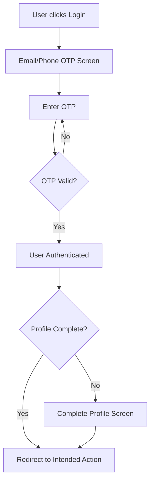
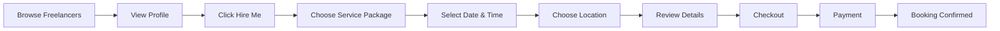
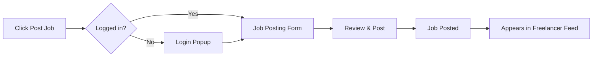
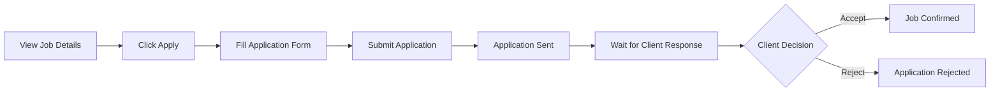
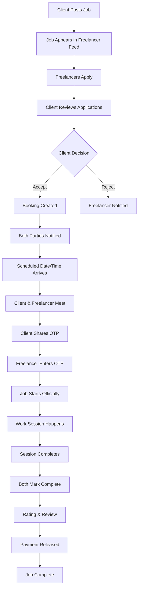

# DoodLance Application Flows

> **Complete user journey documentation for DoodLance cricket services marketplace**

---

## 📋 Table of Contents

1. [Overview](#overview)
2. [User Roles](#user-roles)
3. [Public User Flow (Unauthenticated)](#public-user-flow-unauthenticated)
4. [Authentication & Profile Setup](#authentication--profile-setup)
5. [Client Interface Flows](#client-interface-flows)
6. [Freelancer Interface Flows](#freelancer-interface-flows)
7. [Job Lifecycle](#job-lifecycle)
8. [Communication Flows](#communication-flows)
9. [Data Synchronization Rules](#data-synchronization-rules)
10. [File Upload Flows](#file-upload-flows)
11. [Admin Panel Flows](#admin-panel-flows)

---

## Overview

DoodLance is a dual-sided marketplace where:
- **Clients** can hire cricket professionals directly OR post job requirements
- **Freelancers** offer services via packages OR apply to client job postings
- **Users** can switch between client and freelancer roles seamlessly

---

## User Roles

### Three Primary Roles

| Role | Description | Access |
|------|-------------|--------|
| **Public User** | Unauthenticated visitor | Browse only, must login to hire |
| **Client** | Authenticated user hiring services | Post jobs, hire directly, manage bookings |
| **Freelancer** | Authenticated service provider | Create services, apply to jobs, manage work |
| **Admin** | Platform administrator | Manage all users, bookings, transactions |

### Role Switching

- Users can be BOTH client and freelancer
- Login once, switch interfaces anytime
- Profiles are separate but share basic info (name, phone, profile pic)

---

## Public User Flow (Unauthenticated)

### 1. Landing/Home Page

**What users can see:**

```
┌─────────────────────────────────────┐
│         Home Page                   │
├─────────────────────────────────────┤
│  • Hero Section                     │
│  • Top Rated Experts (Profile Cards)│
│  • Popular Categories (14+ services)│
│  • How It Works                     │
│  • Testimonials                     │
└─────────────────────────────────────┘
```

**Actions:**
- ✅ View top-rated freelancer profiles
- ✅ Browse service categories
- ✅ Click on categories to see freelancers
- ❌ Cannot hire (requires login)

### 2. Hire Page

**What users can see:**

```
┌─────────────────────────────────────┐
│         Hire Page                   │
├─────────────────────────────────────┤
│  View Toggle: [Map View] [List View]│
│                                     │
│  • All available freelancers        │
│  • Filter by category, location    │
│  • Search by name, skills           │
└─────────────────────────────────────┘
```

**Map View:**
- Shows freelancers as pins on map
- Click pin to see profile preview
- Shows service radius

**List View:**
- Grid of freelancer profile cards
- Shows: Name, avatar, rating, skills, hourly rate
- Click card to view full profile

### 3. Service Categories

**14+ Cricket Services organized in 4 groups:**

1. **Playing Services**
   - Match Player
   - Net Bowler
   - Net Batsman
   - Sidearm Specialist

2. **Coaching & Training**
   - Cricket Coach
   - Sports Conditioning Trainer
   - Fitness Trainer

3. **Support Staff**
   - Analyst
   - Physiotherapist
   - Scorer
   - Umpire

4. **Media & Content**
   - Cricket Photographer/Videographer
   - Cricket Content Creator
   - Commentator

**Flow:**
```
User clicks category → See freelancers offering that service → Click profile → View details
```

### 4. Freelancer Profile (Public View)

**Sections visible to public:**

```
┌─────────────────────────────────────┐
│    Freelancer Profile               │
├─────────────────────────────────────┤
│  Header:                            │
│    • Avatar, Name, Title            │
│    • Rating, Reviews Count          │
│    • Location, Verification Badge   │
│                                     │
│  Service Packages:                  │
│    • Basic, Standard, Premium       │
│    • Price, Duration, Features      │
│    • [Hire Me] button              │
│                                     │
│  About:                             │
│    • Bio, Skills, Specializations   │
│    • Cricket role, batting/bowling  │
│                                     │
│  Experience:                        │
│    • Work history timeline          │
│                                     │
│  Portfolio:                         │
│    • Images, videos, achievements   │
│                                     │
│  Reviews:                           │
│    • Client reviews with ratings    │
│    • Verified reviews highlighted   │
└─────────────────────────────────────┘
```

**Actions:**
- ✅ View all profile information
- ❌ Click "Hire Me" → **Login Popup**

### 5. Login Trigger Points

**When unauthenticated users try to:**
- Click "Hire Me" button
- Click "Post a Job" button
- Try to send message
- Try to apply to job (if viewing job details)

**Popup appears:**
```
┌────────────────────────────┐
│  Login to Continue         │
├────────────────────────────┤
│  To hire this expert,      │
│  please login or sign up   │
│                            │
│  [Login] [Sign Up]         │
└────────────────────────────┘
```

---

## Authentication & Profile Setup

### 1. Login/Signup Flow



**Steps:**
1. Click "Login" or "Sign Up"
2. Enter email or phone number
3. Receive OTP
4. Enter OTP
5. **Email auto-saved to profile**
6. If first time → Complete profile
7. Redirect to what they were trying to do

### 2. Profile Completion (First Time)

**Required fields:**

```
┌─────────────────────────────────────┐
│    Complete Your Profile            │
├─────────────────────────────────────┤
│  Email: user@example.com (auto)     │
│  Name: _____________________        │
│  Phone: ____________________        │
│  Profile Picture: [Upload]          │
│  Location: _____________________    │
│                                     │
│  [Continue]                         │
└─────────────────────────────────────┘
```

**Important:** 
- Email is auto-populated from auth
- **Name, Phone, Profile Pic are synced between client & freelancer profiles**

### 3. Role Selection & Switching

**Current Issue:** 
- Freelancer login triggered by clicking profile icon

**Updated Flow:**

```
User wants to become freelancer → Click "Become a Freelancer" → Login required → Switch to Freelancer Interface → Complete freelancer profile
```

**Interface Switching:**

```
┌─────────────────────────────┐
│  Header Navigation          │
│  [Client Mode ▼]           │
│    • Switch to Freelancer   │
│    • Profile Settings       │
│    • Logout                 │
└─────────────────────────────┘
```

**Flow:**
1. User logged in as client
2. Clicks dropdown → "Switch to Freelancer"
3. If freelancer profile not created → Complete freelancer profile
4. If complete → Switch to freelancer dashboard

### 4. Freelancer Profile Setup

**Required information:**

```
Step 1: Basic Info (synced with client)
  • Name ✓ (synced)
  • Phone ✓ (synced)
  • Profile Picture ✓ (synced)
  • Cover Image
  • Title (e.g., "Professional Cricket Coach")
  • About/Bio

Step 2: Professional Details
  • Skills (multi-select)
  • Specializations
  • Cricket Role (Batsman, Bowler, All-rounder, etc.)
  • Batting Style (if applicable)
  • Bowling Style (if applicable)
  • Languages
  • Hourly Rate

Step 3: Services
  • Create service packages
  • Set pricing (Basic, Standard, Premium)
  • Add service details

Step 4: Experience
  • Add work history
  • Company/Team, Role, Duration
  • Description

Step 5: Availability
  • Set weekly schedule
  • Advance notice hours
  • Service radius

Step 6: Bank Details
  • Account holder name
  • Account number
  • IFSC code
  • UPI ID (optional)

Step 7: KYC Verification
  • Upload Aadhaar card
  • Upload PAN card
  • Upload photo ID
  • Selfie for verification
```

**Profile completion tracked:**
- Progress bar shows completion %
- Can save and continue later
- Must complete to start receiving job offers

---

## Client Interface Flows

### 1. Client Dashboard

```
┌─────────────────────────────────────┐
│    Client Dashboard                 │
├─────────────────────────────────────┤
│  Quick Stats:                       │
│    • Active Bookings: 3             │
│    • Pending Applications: 5        │
│    • Completed Jobs: 12             │
│                                     │
│  Quick Actions:                     │
│    • [Post a Job]                   │
│    • [Browse Experts]               │
│                                     │
│  Recent Activity:                   │
│    • Application received           │
│    • Booking confirmed              │
│    • New message                    │
└─────────────────────────────────────┘
```

### 2. Direct Hire Flow

**Step-by-step process:**



**Detailed Steps:**

#### Step 1: Choose Service Package

```
┌─────────────────────────────────────┐
│  Select a Service Package           │
├─────────────────────────────────────┤
│  ○ Basic - ₹1,500/session          │
│    • 1 hour session                 │
│    • Basic training                 │
│                                     │
│  ○ Standard - ₹3,000/session       │
│    • 2 hour session                 │
│    • Advanced techniques            │
│    • Video analysis                 │
│                                     │
│  ○ Premium - ₹5,000/session        │
│    • 3 hour session                 │
│    • Personalized plan              │
│    • Ongoing support                │
│                                     │
│  [Continue]                         │
└─────────────────────────────────────┘
```

#### Step 2: Select Date & Time

```
┌─────────────────────────────────────┐
│  Choose Date & Time                 │
├─────────────────────────────────────┤
│  Calendar: [January 2026]           │
│  Available dates highlighted        │
│                                     │
│  Time Slots for Jan 10:             │
│  ○ 6:00 AM - 9:00 AM               │
│  ○ 4:00 PM - 7:00 PM               │
│  ○ 7:00 PM - 10:00 PM              │
│                                     │
│  [Continue]                         │
└─────────────────────────────────────┘
```

#### Step 3: Choose Location

```
┌─────────────────────────────────────┐
│  Select Location                    │
├─────────────────────────────────────┤
│  ○ Freelancer's Location            │
│    Chinnaswamy Stadium, Bangalore   │
│                                     │
│  ○ My Location                      │
│    [Enter Address]                  │
│    [Use Current Location]           │
│                                     │
│  [Continue]                         │
└─────────────────────────────────────┘
```

#### Step 4: Checkout

```
┌─────────────────────────────────────┐
│  Review Booking                     │
├─────────────────────────────────────┤
│  Service: Cricket Coaching          │
│  Package: Standard                  │
│  Date: Jan 10, 2026                 │
│  Time: 4:00 PM - 7:00 PM           │
│  Location: My Location              │
│                                     │
│  Subtotal:        ₹3,000            │
│  Platform Fee:    ₹150              │
│  GST (18%):      ₹540              │
│  ─────────────────────              │
│  Total:          ₹3,690             │
│                                     │
│  [Proceed to Payment]               │
└─────────────────────────────────────┘
```

#### Step 5: Payment

```
┌─────────────────────────────────────┐
│  Payment                            │
├─────────────────────────────────────┤
│  Pay ₹3,690                         │
│                                     │
│  Payment Method:                    │
│  ○ UPI                              │
│  ○ Credit/Debit Card                │
│  ○ Wallet                           │
│                                     │
│  [Pay Now]                          │
└─────────────────────────────────────┘
```

#### Step 6: Booking Confirmed

```
┌─────────────────────────────────────┐
│  ✓ Booking Confirmed!               │
├─────────────────────────────────────┤
│  Booking ID: #BK123456              │
│  OTP to Start: 4521                 │
│                                     │
│  Share this OTP with the freelancer │
│  when you meet for the session.     │
│                                     │
│  [View Booking] [Message Freelancer]│
└─────────────────────────────────────┘
```

### 3. Post a Job Flow

**Requirements:**
- Must be logged in
- If not logged in → Login popup

**Steps:**



**Job Posting Form:**

```
┌─────────────────────────────────────┐
│  Post a Job                         │
├─────────────────────────────────────┤
│  Job Title: ____________________    │
│                                     │
│  Category: [Select Category ▼]     │
│                                     │
│  Description:                       │
│  ___________________________________│
│  ___________________________________│
│                                     │
│  Budget:                            │
│  ○ Fixed: ₹________                 │
│  ○ Range: ₹_______ to ₹_______     │
│                                     │
│  Location: _____________________    │
│  [Use Map]                          │
│                                     │
│  Work Mode:                         │
│  ○ On-site  ○ Remote  ○ Hybrid     │
│                                     │
│  Job Type:                          │
│  ○ One-time  ○ Part-time           │
│  ○ Full-time  ○ Contract           │
│                                     │
│  Skills Required:                   │
│  [Add Skills]                       │
│                                     │
│  Experience Level:                  │
│  ○ Entry  ○ Intermediate  ○ Expert │
│                                     │
│  Scheduled Start: [Date Picker]     │
│                                     │
│  Duration: _____________________    │
│                                     │
│  [Post Job]                         │
└─────────────────────────────────────┘
```

### 4. My Bookings Page

**Three Tabs:**

```
┌─────────────────────────────────────┐
│  My Bookings                        │
├─────────────────────────────────────┤
│  [Active] [Applications] [History]  │
└─────────────────────────────────────┘
```

#### Tab 1: Active

**Shows:**
- Direct hires (as Job Cards)
- Accepted applications (as Job Cards)

**Job Card:**

```
┌─────────────────────────────────────┐
│  Cricket Coaching Session           │
│  with Rahul Sharma                  │
├─────────────────────────────────────┤
│  📅 Jan 10, 2026 • 4:00 PM         │
│  📍 My Location, Bangalore         │
│                                     │
│  Status: Scheduled                  │
│  OTP to Start: 4521                 │
│                                     │
│  [View Details] [Message] [Call]    │
└─────────────────────────────────────┘
```

#### Tab 2: Applications

**Shows:**
- Job posts with received applications

**Application Card:**

```
┌─────────────────────────────────────┐
│  Need Cricket Coach for Team        │
│  Posted: 2 days ago                 │
├─────────────────────────────────────┤
│  5 Applications Received            │
│                                     │
│  Recent Applicants:                 │
│  • Rahul S. - ₹3,000/session       │
│  • Amit K. - ₹2,500/session        │
│  • Priya M. - ₹4,000/session       │
│                                     │
│  [View All Applications]            │
└─────────────────────────────────────┘
```

**Clicking "View All Applications":**

```
┌─────────────────────────────────────┐
│  Applications for: Cricket Coach    │
├─────────────────────────────────────┤
│  ┌─────────────────────────────┐   │
│  │ Rahul Sharma  ⭐ 4.8       │   │
│  │ Professional Coach          │   │
│  │ Proposed Rate: ₹3,000       │   │
│  │ Estimated Days: 5           │   │
│  │                             │   │
│  │ Cover Letter:               │   │
│  │ "I have 10 years of...     │   │
│  │                             │   │
│  │ [Accept] [Reject] [Message] │   │
│  └─────────────────────────────┘   │
│                                     │
│  [Load More]                        │
└─────────────────────────────────────┘
```

**Actions:**
- **Accept** → Booking created, freelancer notified, moved to Active tab
- **Reject** → Freelancer notified, application marked rejected
- **Message** → Open chat conversation

#### Tab 3: History

**Shows:**
- Completed bookings
- Cancelled bookings
- Rejected applications

---

## Freelancer Interface Flows

### 1. Freelancer Dashboard

```
┌─────────────────────────────────────┐
│    Freelancer Dashboard             │
├─────────────────────────────────────┤
│  Profile Completion: 85% ████░      │
│                                     │
│  Quick Stats:                       │
│    • Active Jobs: 2                 │
│    • Pending Applications: 3        │
│    • This Month Earnings: ₹45,000   │
│    • Rating: 4.8 ⭐                 │
│                                     │
│  Quick Actions:                     │
│    • [Create Service]               │
│    • [Browse Jobs]                  │
│    • [Update Availability]          │
│                                     │
│  Recent Activity:                   │
│    • New job posted                 │
│    • Application accepted           │
│    • Review received                │
└─────────────────────────────────────┘
```

### 2. Feed Page (Job Discovery)

**Two Tabs:**

```
┌─────────────────────────────────────┐
│  Job Feed                           │
├─────────────────────────────────────┤
│  [For You] [Explore All]            │
└─────────────────────────────────────┘
```

#### Tab 1: For You

**Logic:**
- Filter jobs based on freelancer's skills
- Match category with freelancer's services
- Location-based (within service radius)
- Experience level match

**Job Card:**

```
┌─────────────────────────────────────┐
│  Need Cricket Coach for Academy     │
│  Posted 1 hour ago                  │
├─────────────────────────────────────┤
│  📍 5 km away • Bangalore           │
│  💰 ₹3,000 - ₹5,000                 │
│  📅 Starts: Jan 15, 2026            │
│                                     │
│  Skills: Cricket Coaching, Batting  │
│  Experience: Intermediate           │
│                                     │
│  3 applicants • Closes in 5 days    │
│                                     │
│  [View Details] [Apply Now]         │
└─────────────────────────────────────┘
```

#### Tab 2: Explore All

**Shows:**
- All available job postings
- No filtering by skills
- Can use search and filters

**Filters:**
```
┌─────────────────────────────────────┐
│  Filters                            │
├─────────────────────────────────────┤
│  Category: [All ▼]                  │
│  Budget: ₹____ to ₹____             │
│  Location: [Bangalore ▼]            │
│  Work Mode: ☐ Remote ☐ On-site     │
│  Job Type: ☐ One-time ☐ Contract   │
│  Experience: [All ▼]                │
│                                     │
│  [Apply Filters] [Clear]            │
└─────────────────────────────────────┘
```

### 3. Job Application Flow



**Application Form:**

```
┌─────────────────────────────────────┐
│  Apply for: Cricket Coach           │
├─────────────────────────────────────┤
│  Proposed Rate: ₹ __________        │
│  (Client budget: ₹3,000 - ₹5,000)   │
│                                     │
│  Estimated Days: _______            │
│                                     │
│  Cover Letter:                      │
│  Why are you the best fit for this  │
│  job?                               │
│  ___________________________________│
│  ___________________________________│
│  ___________________________________│
│                                     │
│  Skills: [Pre-filled from profile]  │
│  + [Add More Skills]                │
│                                     │
│  Attachments (Optional):            │
│  [Upload Files]                     │
│                                     │
│  [Submit Application]               │
└─────────────────────────────────────┘
```

### 4. My Jobs Page

**Tabs:**

```
┌─────────────────────────────────────┐
│  My Jobs                            │
├─────────────────────────────────────┤
│  [Active] [Proposals] [History]     │
└─────────────────────────────────────┘
```

#### Tab 1: Active

**Shows:**
- Accepted applications
- Direct bookings from clients
- Jobs ready to start (with OTP input)

**Job Card (Scheduled):**

```
┌─────────────────────────────────────┐
│  Cricket Coaching Session           │
│  with Amit Patel                    │
├─────────────────────────────────────┤
│  📅 Tomorrow, 4:00 PM               │
│  📍 Chinnaswamy Stadium             │
│  💰 ₹3,000                          │
│                                     │
│  Status: Scheduled                  │
│  [Enter OTP to Start]               │
│                                     │
│  [View Details] [Message] [Call]    │
└─────────────────────────────────────┘
```

**Job Card (In Progress):**

```
┌─────────────────────────────────────┐
│  Cricket Coaching Session           │
│  with Amit Patel                    │
├─────────────────────────────────────┤
│  Started: 30 mins ago               │
│  📍 Chinnaswamy Stadium             │
│  💰 ₹3,000                          │
│                                     │
│  Status: In Progress ⏱️            │
│  Timer: 00:30:15                    │
│                                     │
│  [Mark as Complete]                 │
└─────────────────────────────────────┘
```

#### Tab 2: Proposals

**Shows:**
- Pending applications
- Under review applications

**Application Card:**

```
┌─────────────────────────────────────┐
│  Cricket Coach for Academy          │
│  Applied: 2 hours ago               │
├─────────────────────────────────────┤
│  Status: Under Review               │
│  Your Rate: ₹3,500                  │
│                                     │
│  5 total applicants                 │
│                                     │
│  [View Application] [Withdraw]      │
└─────────────────────────────────────┘
```

#### Tab 3: History

**Shows:**
- Completed jobs with ratings
- Rejected applications
- Cancelled bookings

---

## Job Lifecycle

### Complete Flow from Start to Finish



### Detailed Steps

#### Step 1: Job Posted

- Client fills job form
- Job saved to database
- Status: `OPEN`
- Notifications sent to matching freelancers

#### Step 2: Job Discovery

- Job appears in freelancer feed
- "For You" tab shows if skills match
- "Explore All" tab shows all jobs
- Freelancers can filter and search

#### Step 3: Application Submission

- Freelancer fills application form
- Includes: proposed rate, estimated days, cover letter
- Status: `PENDING`
- Client notified of new application

#### Step 4: Client Reviews

- Client views all applications
- Can filter by rate, experience, rating
- Can message applicants for clarification
- Makes decision: Accept or Reject

#### Step 5: Application Accepted

- Status changes to `ACCEPTED`
- Booking created automatically
- **OTP generated** (e.g., 4521)
- Both parties notified
- Job moved to Active tab

#### Step 6: Pre-Session

- Client can message freelancer
- Confirm location, time
- Share any special requirements
- Both prepare for session

#### Step 7: Session Start

**At scheduled time:**

1. Client and freelancer meet
2. Client shares OTP: "4521"
3. Freelancer clicks "Enter OTP to Start"
4. Enters OTP in popup:

```
┌─────────────────────────────┐
│  Enter OTP to Start Job     │
├─────────────────────────────┤
│  Client's OTP: ____         │
│                             │
│  [Start Job]                │
└─────────────────────────────┘
```

5. System validates OTP
6. If correct → Job status: `IN_PROGRESS`
7. Timer starts

#### Step 8: During Session

- Timer runs in background
- Both can access job details
- Can communicate via chat
- Job card shows "In Progress"

#### Step 9: Session Complete

**Both must mark complete:**

**Client's view:**

```
┌─────────────────────────────────────┐
│  Mark Job Complete                  │
├─────────────────────────────────────┤
│  Was the service satisfactory?      │
│                                     │
│  Rating: ⭐⭐⭐⭐⭐               │
│                                     │
│  Communication: ⭐⭐⭐⭐⭐         │
│  Quality: ⭐⭐⭐⭐⭐               │
│  Timeliness: ⭐⭐⭐⭐⭐            │
│                                     │
│  Review:                            │
│  ___________________________________│
│  ___________________________________│
│                                     │
│  [Submit Review]                    │
└─────────────────────────────────────┘
```

**Freelancer's view:**

```
┌─────────────────────────────────────┐
│  Mark Job Complete                  │
├─────────────────────────────────────┤
│  How was working with this client?  │
│                                     │
│  Rating: ⭐⭐⭐⭐⭐               │
│                                     │
│  Review:                            │
│  ___________________________________│
│  ___________________________________│
│                                     │
│  [Submit & Complete]                │
└─────────────────────────────────────┘
```

#### Step 10: Payment & Completion

1. Both submit reviews
2. Status changes to `COMPLETED`
3. Payment released to freelancer
4. Platform fee deducted
5. Reviews visible on both profiles
6. Job moved to History

---

## Communication Flows

### 1. In-App Chat

**Access points:**
- From job card: [Message] button
- From freelancer profile: [Message] button
- From inbox page

**Chat Interface:**

```
┌─────────────────────────────────────┐
│  ← Chat with Rahul Sharma           │
├─────────────────────────────────────┤
│                        Hi! 10:30 AM │
│                                     │
│  Hello, I'm interested  10:31 AM    │
│  in your service                    │
│                                     │
│               Sounds great! 10:32 AM│
│                                     │
│  [Type a message...]  [📎] [Send]  │
└─────────────────────────────────────┘
```

**Features:**
- Text messages
- File attachments (images, documents)
- Read receipts
- Typing indicators
- Conversation history

### 2. Call Feature

**Access:**
- [Call] button on job card
- [Call] button in chat

**When clicked:**
- Opens phone dialer with freelancer's phone number
- Or initiates in-app call (if WebRTC implemented)

### 3. Inbox Page

**Both Client and Freelancer have:**

```
┌─────────────────────────────────────┐
│  Inbox                              │
├─────────────────────────────────────┤
│  Search: [__________]  [Filter ▼]   │
│                                     │
│  Conversations:                     │
│                                     │
│  ┌─────────────────────────────┐   │
│  │ 🟢 Rahul Sharma             │   │
│  │ Great! See you tomorrow     │   │
│  │ 2 hours ago            [2]  │   │
│  └─────────────────────────────┘   │
│                                     │
│  ┌─────────────────────────────┐   │
│  │ Amit Patel                  │   │
│  │ Thanks for the session      │   │
│  │ Yesterday                   │   │
│  └─────────────────────────────┘   │
│                                     │
└─────────────────────────────────────┘
```

**Features:**
- Shows all conversations
- Unread count badge
- Recent message preview
- Online status indicator
- Search and filter

---

## Data Synchronization Rules

### Synced Fields Between Client & Freelancer Profiles

**These fields are SHARED:**

| Field | Source | Synced To | When |
|-------|--------|-----------|------|
| **Email** | Supabase Auth | User table | On login (auto) |
| **Name** | First profile filled | Both profiles | On save |
| **Phone** | First profile filled | Both profiles | On save |
| **Profile Picture** | First upload | Both profiles | On save |

### Logic

```typescript
// When user updates name, phone, or profile pic
// on EITHER client OR freelancer profile:

1. Update users table
2. If freelancer_profile exists → update it
3. If client_profile exists → update it

// Result: All 3 places have same value
```

### Example Flow

```
User logs in (email: user@example.com)
  └→ Email auto-saved to users table

User completes client profile:
  └→ Name: "Rahul Sharma"
  └→ Phone: "+919876543210"
  └→ Profile Pic: "avatar.jpg"
  
  Result: 
    users.name = "Rahul Sharma"
    users.phone = "+919876543210"
    users.avatar = "avatar.jpg"
    client_profile created with other fields

User switches to freelancer:
  └→ Name, Phone, Profile Pic PRE-FILLED ✓
  └→ User fills: Skills, Services, Experience, etc.
  
  Result:
    freelancer_profile.userId = user.id (links to same user)
    Name, phone, pic already synced ✓
```

### API Implementation

**When updating user profile:**

```typescript
// API: PATCH /api/user/update

// 1. Always update users table
await prisma.user.update({
  where: { id: userId },
  data: { name, phone, avatar }
});

// 2. Update client_profile if exists
const clientProfile = await prisma.clientProfile.findUnique({
  where: { userId }
});
if (clientProfile) {
  // Client profile doesn't store name/phone/avatar
  // It's fetched from users table via relation
}

// 3. Update freelancer_profile if exists  
const freelancerProfile = await prisma.freelancerProfile.findUnique({
  where: { userId }
});
if (freelancerProfile) {
  // Freelancer profile doesn't store name/phone/avatar
  // It's fetched from users table via relation
}
```

### Fields NOT Synced

**Client-specific:**
- Company
- Industry
- Project history

**Freelancer-specific:**
- Skills
- Services
- Experience
- Portfolio
- Availability
- Bank details
- KYC documents

---

## File Upload Flows

### Storage Structure in Supabase

```
supabase-storage/
├── avatars/              (Public bucket)
│   └── {userId}/
│       └── avatar-{timestamp}.jpg
│
├── cover-images/         (Public bucket)
│   └── {userId}/
│       └── cover-{timestamp}.jpg
│
├── verification-docs/    (Private bucket)
│   └── {userId}/
│       ├── aadhaar-front.jpg
│       ├── aadhaar-back.jpg
│       ├── pan-card.jpg
│       └── selfie.jpg
│
├── portfolio/            (Public bucket)
│   └── {freelancerId}/
│       └── {portfolioItemId}/
│           ├── image1.jpg
│           ├── image2.jpg
│           └── video1.mp4
│
└── attachments/          (Private bucket)
    └── {conversationId}/
        └── {messageId}/
            └── file.pdf
```

### Upload Flow

#### 1. Profile Picture Upload

```typescript
// When user uploads avatar
1. User selects image
2. Frontend validates (size, format)
3. Upload to Supabase Storage: avatars/{userId}/avatar-{timestamp}.jpg
4. Get public URL
5. Update database:
   - users.avatar = publicUrl
6. Delete old avatar (if exists)
```

#### 2. KYC Document Upload

```typescript
// When freelancer uploads verification docs
1. User selects document
2. Upload to Supabase Storage: verification-docs/{userId}/aadhaar-front.jpg
3. Get file path (NOT public URL - private bucket)
4. Update database:
   - freelancer_profile.verificationDocs = JSON with file paths
5. Admin can review and approve
```

#### 3. Portfolio Upload

```typescript
// When freelancer adds portfolio item
1. Create portfolio item with details
2. User uploads images/videos
3. Upload to: portfolio/{freelancerId}/{portfolioItemId}/
4. Get public URLs
5. Update database:
   - portfolio.images = JSON array of URLs
```

### RLS Policies for Storage

**Avatars Bucket (Public):**

```sql
-- Anyone can read
CREATE POLICY "Public avatars viewable"
ON storage.objects FOR SELECT
USING (bucket_id = 'avatars');

-- Users can upload own avatar
CREATE POLICY "Users upload own avatar"
ON storage.objects FOR INSERT
WITH CHECK (
  bucket_id = 'avatars'
  AND auth.uid()::text = (storage.foldername(name))[1]
);

-- Users can update own avatar
CREATE POLICY "Users update own avatar"
ON storage.objects FOR UPDATE
USING (
  bucket_id = 'avatars'
  AND auth.uid()::text = (storage.foldername(name))[1]
);
```

**verification-docs Bucket (Private):**

```sql
-- Users can upload own docs
CREATE POLICY "Users upload own verification docs"
ON storage.objects FOR INSERT
WITH CHECK (
  bucket_id = 'verification-docs'
  AND auth.uid()::text = (storage.foldername(name))[1]
);

-- Users can read own docs
CREATE POLICY "Users read own verification docs"
ON storage.objects FOR SELECT
USING (
  bucket_id = 'verification-docs'
  AND auth.uid()::text = (storage.foldername(name))[1]
);

-- Admins can read all docs (implement via service role in admin API)
```

### Database Storage Pattern

**All uploaded files should:**
1. Save to Supabase Storage
2. Store reference in database (URL or path)
3. Link to user via Supabase Auth ID

**Example:**

```typescript
// Upload flow
const file = formData.get('file');
const userId = user.id; // from Supabase auth

// Upload to storage
const fileName = `${userId}/avatar-${Date.now()}.jpg`;
const { data, error } = await supabase.storage
  .from('avatars')
  .upload(fileName, file);

// Get public URL
const { data: { publicUrl } } = supabase.storage
  .from('avatars')
  .getPublicUrl(fileName);

// Save to database
await prisma.user.update({
  where: { id: userId },
  data: { avatar: publicUrl }
});
```

---

## Admin Panel Flows

### 1. Admin Login

**Separate from user login:**

```
┌─────────────────────────────┐
│  Admin Login                │
├─────────────────────────────┤
│  Email: ________________    │
│  Password: _____________    │
│                             │
│  [Login]                    │
└─────────────────────────────┘
```

**Auth:**
- Uses `admins` table (NOT `users` table)
- Password-based (hashed with bcrypt)
- Session stored separately
- Admin routes protected with admin middleware

### 2. Admin Dashboard

```
┌─────────────────────────────────────┐
│  Admin Dashboard                    │
├─────────────────────────────────────┤
│  Platform Overview:                 │
│    • Total Users: 1,254             │
│    • Active Freelancers: 387        │
│    • Active Clients: 867            │
│    • Total Bookings: 4,521          │
│    • Revenue This Month: ₹12,45,000 │
│                                     │
│  Recent Activity:                   │
│    • New user registered            │
│    • Booking completed              │
│    • KYC submitted for review       │
│                                     │
│  Quick Actions:                     │
│    • [Pending KYC: 12]              │
│    • [Disputes: 2]                  │
│    • [Support Tickets: 5]           │
└─────────────────────────────────────┘
```

### 3. Manage Users

**Features:**
- View all users (clients & freelancers)
- Search and filter
- View user details
- Suspend/Ban users
- Verify KYC
- View activity logs

### 4. Manage Bookings

**Features:**
- View all bookings
- Filter by status (pending, active, completed, cancelled)
- View booking details
- Resolve disputes
- Refund processing

### 5. Manage Jobs

**Features:**
- View all job postings
- Monitor applications
- Take down inappropriate jobs
- View job metrics

### 6. Transactions

**Features:**
- View all transactions
- Filter by type (payment, refund, withdrawal)
- Export reports
- Monitor platform fees

### 7. KYC Verification

**Workflow:**

```
1. Freelancer uploads KYC docs
2. Admin receives notification
3. Admin reviews documents
4. Admin decision:
   ✅ Approve → Set isVerified = true
   ❌ Reject → Notify freelancer, request re-upload
```

**Interface:**

```
┌─────────────────────────────────────┐
│  KYC Verification                   │
│  Freelancer: Rahul Sharma           │
├─────────────────────────────────────┤
│  Aadhaar Card:                      │
│    [View Front] [View Back]         │
│                                     │
│  PAN Card:                          │
│    [View Document]                  │
│                                     │
│  Selfie:                            │
│    [View Photo]                     │
│                                     │
│  Notes: ________________________    │
│                                     │
│  [Approve] [Reject] [Request More]  │
└─────────────────────────────────────┘
```

### 8. Analytics & Reports

**Metrics tracked:**
- User growth
- Booking trends
- Revenue analytics
- Category performance
- Freelancer ratings
- Client retention

---

## Summary of Key Flows

### Critical User Journeys

1. **Public to Client**
   - Browse → View profile → Click hire → Login → Complete profile → Hire

2. **Client to Freelancer**
   - Dashboard → Switch to freelancer → Complete profile → Browse jobs → Apply

3. **Direct Hire**
   - Browse → Profile → Hire → Package → Date/Time → Location → Checkout → Payment → OTP → Session → Complete → Review

4. **Job Application**
   - Post job → Freelancer sees → Apply → Client reviews → Accept → OTP → Session → Complete → Review

5. **Profile Sync**
   - Update name/phone/pic on either side → Auto-sync to both sides

6. **File Upload**
   - Upload → Supabase Storage → Get URL → Save to database

7. **Admin Verification**
   - User uploads KYC → Admin notified → Review → Approve/Reject → User notified

---

## Implementation Checklist

### For Each Flow, Ensure:

- [ ] API routes exist and work
- [ ] Authentication checks in place
- [ ] Authorization checks (user owns resource)
- [ ] Data validation
- [ ] Error handling
- [ ] Success/error notifications
- [ ] Database transactions where needed
- [ ] File uploads save to Supabase Storage
- [ ] Email notifications sent
- [ ] Real-time updates (if applicable)
- [ ] Mobile responsive UI
- [ ] Loading states
- [ ] Empty states

---

**Last Updated:** January 2, 2026  
**Version:** 1.0.0  

> This document should be the **source of truth** for all application flows. Reference this when building features, fixing bugs, or onboarding new developers.
