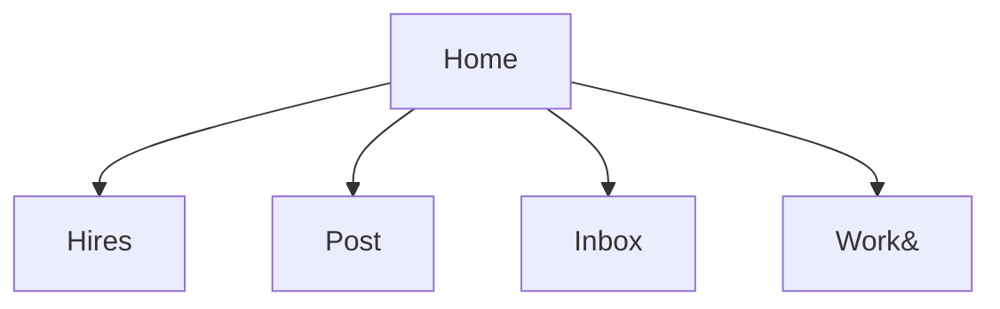
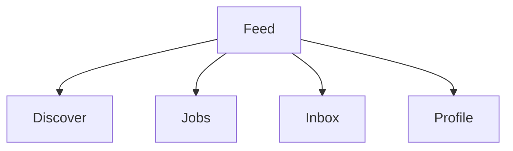
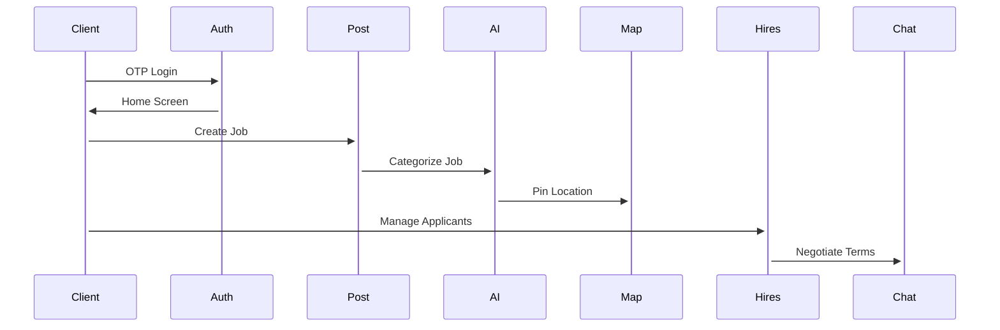
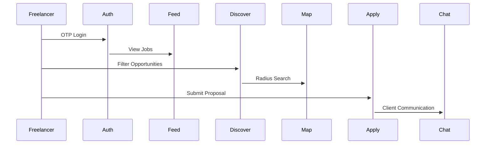

# Skill Bridge AI - Application Context

## 1. Vision & Purpose
Skill Bridge AI is a hyper-local service marketplace that connects skilled professionals with immediate needs in their neighborhood. The platform leverages AI and geospatial technology to create meaningful local connections and opportunities.

### Key Differentiators
- Dual interface system (Client/Freelancer)
- AI-powered skill matching
- Map-centric discovery
- Seamless role switching
- Local community focus

## 2. User Experience

### 2.1 User Roles
| Role | Access | Key Actions |
|------|--------|-------------|
| **Client** | Post jobs, Hire freelancers, Manage payments | Create listings, Review applicants, Chat |
| **Freelancer** | Find jobs, Apply to gigs, Build portfolio | Set availability, Negotiate rates, Showcase work |

### 2.2 Interface Flows

#### Client Navigation


#### Freelancer Navigation


### 2.3 Key User Journeys

#### Client Flow


#### Freelancer Flow


## 3. Technical Architecture

### 3.1 Core Stack
- **Frontend**: Next.js PWA
- **State Management**: Zustand
- **Styling**: Tailwind + shadcn-ui
- **Maps**: Mapbox GL JS
- **AI**: Hugging Face Pipelines

### 3.2 Services Integration
| Service | Usage | Key Benefit |
|---------|-------|-------------|
| Supabase | Auth/DB/Realtime | Unified backend |
| Mapbox | Geospatial features | Custom map styling |
| Hugging Face | NLP processing | Context-aware categorization |

## 4. Core Features

### 4.1 Authentication & Profiles
- Mobile OTP verification
- Role selection (Work/Hire)
- Profile management
- Skill verification
- Portfolio showcase

### 4.2 Skill Matching & AI
- AI-powered matching
- Natural language processing
- Recommendation engine
- Skill gap analysis
- Learning recommendations

### 4.3 Location Services
- Interactive map interface
- Location-based discovery
- Geospatial search
- Distance-based matching
- Heatmap visualization

### 4.4 Opportunity Management
- Job posting system
- Project collaboration
- Skill exchange
- Event management
- Application tracking

### 4.5 Learning & Development
- Skill assessment
- Learning paths
- Resource sharing
- Progress tracking
- Certification programs

## 5. Design System

### 5.1 Visual Language
- **Colors**: 
  - Client: Blue dominance (trust)
  - Freelancer: Green accents (growth)
- **Motion**: Framer-powered transitions
- **Grid System**: 8px baseline grid

### 5.2 Component Library
1. Smart Cards (Jobs/Freelancers)
2. Interactive Map Markers
3. Progress Trackers
4. Rating Systems

## 6. Data Models

### User Profile
```typescript
interface UserProfile {
  id: string;
  email: string;
  name: string;
  role: 'client' | 'freelancer';
  location: {
    coordinates: [number, number];
    address: string;
  };
  skills: Skill[];
  experience: Experience[];
  certifications: Certification[];
  preferences: UserPreferences;
}
```

### Skill
```typescript
interface Skill {
  id: string;
  name: string;
  category: string;
  level: 'beginner' | 'intermediate' | 'advanced' | 'expert';
  verified: boolean;
  endorsements: number;
}
```

### Opportunity
```typescript
interface Opportunity {
  id: string;
  title: string;
  description: string;
  type: 'job' | 'project' | 'event' | 'learning';
  requiredSkills: Skill[];
  location: {
    coordinates: [number, number];
    address: string;
  };
  postedBy: string;
  createdAt: Date;
  status: 'open' | 'closed' | 'in-progress';
}
```

## 7. Security & Compliance
- End-to-end encryption
- KYC verification
- Payment escrow
- GDPR compliance
- Data protection

## 8. Development Roadmap

### Phase 1: Foundation
- [ ] Project setup
- [ ] Authentication
- [ ] Basic profiles
- [ ] Map integration

### Phase 2: Core Features
- [ ] Skill matching
- [ ] Opportunity management
- [ ] Location search
- [ ] Basic AI integration

### Phase 3: Enhanced Features
- [ ] Advanced AI
- [ ] Learning paths
- [ ] Real-time collaboration
- [ ] Mobile optimization

### Phase 4: Polish & Scale
- [ ] Performance optimization
- [ ] Analytics
- [ ] Community features
- [ ] API documentation

## 9. Future Vision
- Equipment rental marketplace
- Skill certification programs
- Local business partnerships
- AR-powered service previews

## 10. Implementation Notes
- Secure data storage in Supabase
- Robust error handling
- Mobile-first design
- Accessibility compliance
- API key security

